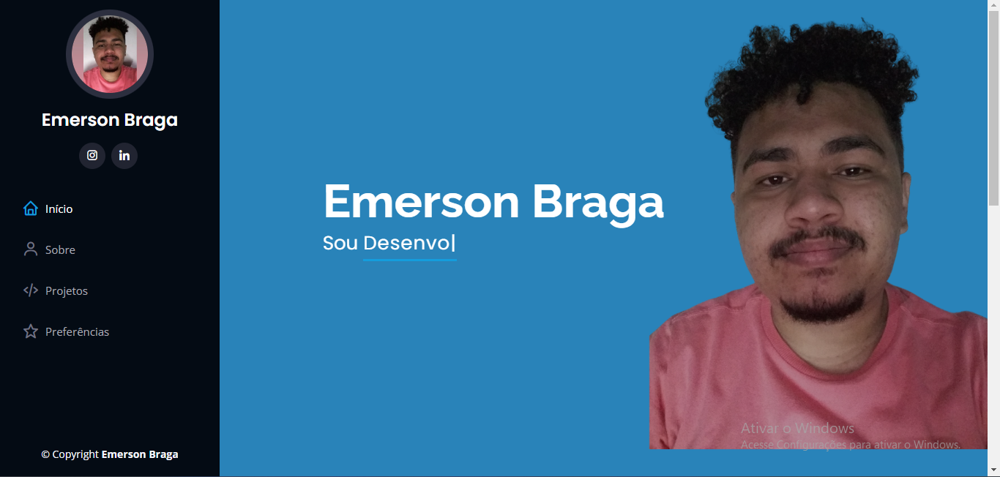
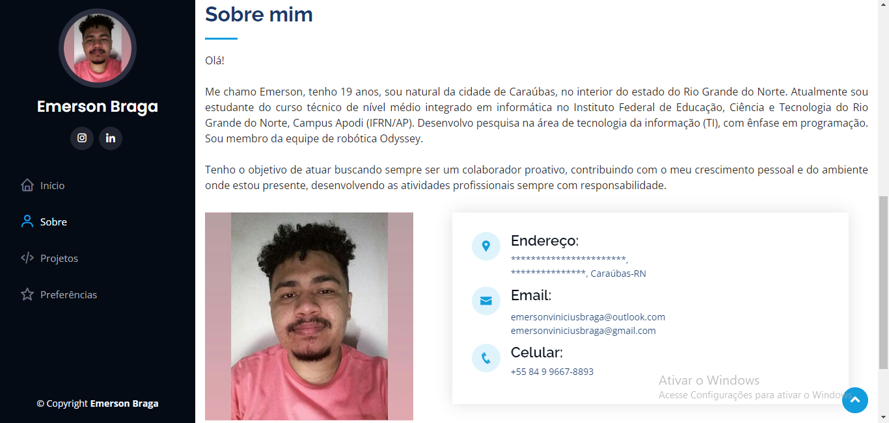
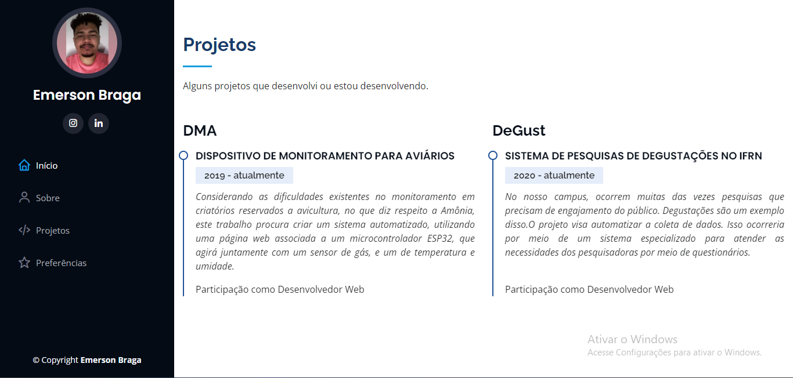
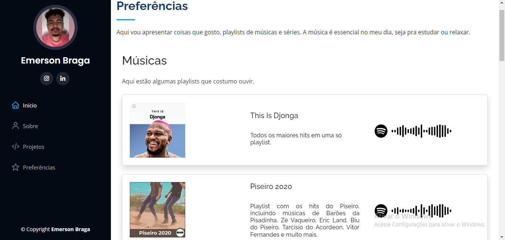
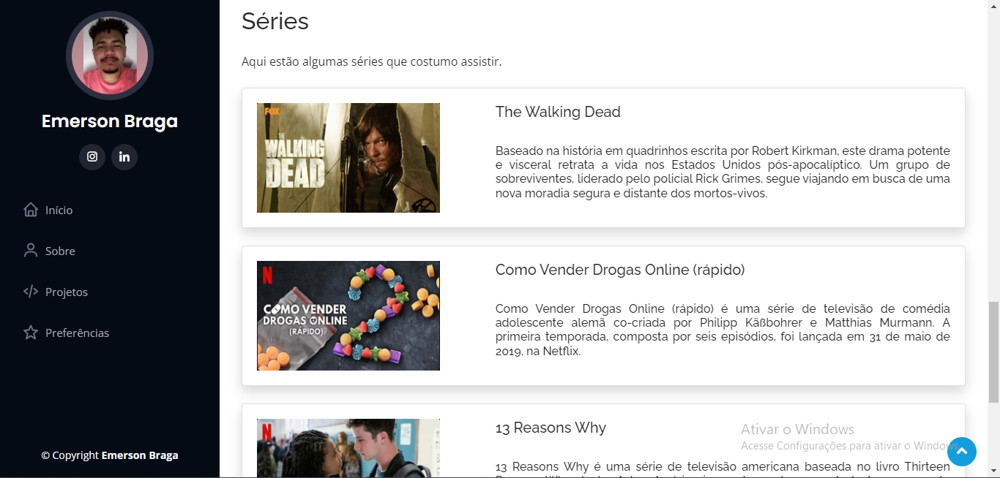

# Projeto de Página Pessoal.

## Esse projeto foi desenvolvido enquanto cursava o técnico em informática, o objetivo era pegar um template e modificá-lo com nossos dados e aplicá-lo no framework Codeigniter 3.

## O template que utilizei foi o [iPortfolio](https://bootstrapmade.com/iportfolio-bootstrap-portfolio-websites-template/).

* ### Sessão de Início

    

* ### Sessão de Sobre

    

* ### Sessão de Projetos

    

* ### Sessão de Preferências/Gostos

    
    

